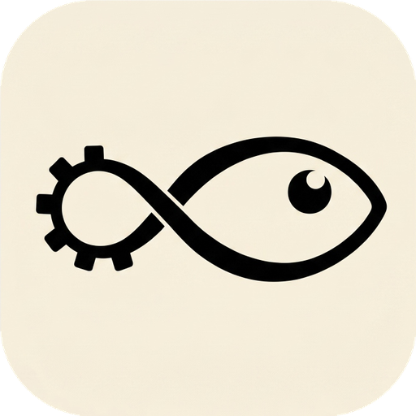
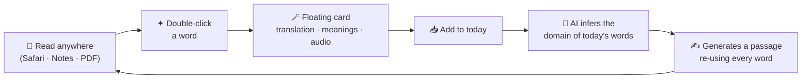

<div align="center">



# Lexantir

**A small notebook for words.**

Capture English words anywhere you read — then *re-read them, woven back into a story of your own.*

<br/>


</div>

---

## What is this?

Lexantir is a macOS vocabulary app built on **Content and Language Integrated Learning (CLIL)** —
the idea that you learn a language fastest by *using it to learn something else*.

It is **not** a flashcard app. The loop is different:

> You read in the wild → capture words with a double-click → the app infers the *domain*
> of today's words → an LLM writes you a short passage that re-uses **every word you caught today**,
> in context that's actually about your interests. You read it back. The words stick because
> they came home to a story.

<br/>



---

## The signature move

While reading **anywhere on macOS**, double-click an English word. A small floating card appears
right by your cursor — the word, its part of speech, a Chinese translation, multiple meanings — and
it's **spoken aloud automatically**. The card floats over every other app **without stealing focus**,
so your text selection in Safari survives.

Two buttons: **Add daily** or **+ Example**. That's the whole interaction. Capture cost ≈ zero.

---

## Features

| | |
|---|---|
| 🪄 **System-wide capture** | Double-click / drag-select / `⌘⇧D` anywhere → floating translation popup with auto-TTS |
| 📚 **Polysemy** | One lookup returns the full bilingual dictionary; every meaning shown on cards & popup |
| ✦ **Today's Article (CLIL)** | DeepSeek weaves *all* of today's words into a coherent passage at your chosen level & domain |
| 🔤 **Tap-to-translate reading** | Double-click **any** word in a generated article → same popup, with a sand-gold selection highlight |
| ✍️ **Spell Check** | Duolingo-style drill: see the Chinese, type the English. First-try-correct = **Mastered** |
| 🎉 **Gentle celebration** | Soft Morandi confetti on session completion — no neon, no XP, no dread |
| 📅 **Calendar** | GitHub-style heatmap of daily spell-correctness + streaks + a rotating quote |
| 🌗 **Themes** | Light · Dark ("warm black") · Follow-System |
| 🌐 **i18n** | English · 简体中文 · 日本語 |
| 🍵 **Menu-bar agent** | Runs quietly in the background; no Dock icon |

---

## Design language

A restrained, **Morandi-inspired** palette — desaturated, dusty, warm. Warm-white "notebook paper"
with a faint dot grid, cream cards, soft shadows, claymorphic sand buttons, Georgia serif throughout.
No vivid greens, reds, or blues anywhere.


*Reference points: Apple Notes · the Claude app on Mac · the Duolingo spell screen · a paper dot-grid notebook.*

---

## Tech stack

- **JDK 23** · **JavaFX 23.0.1** · **Maven** — imperative JavaFX, no FXML
- **SQLite** (`sqlite-jdbc`) — local store at `~/Library/Application Support/WordBook/wordbook.db`
- **JNativeHook** — global mouse / keyboard capture
- **JNA → Cocoa** — floating-panel window level, foreground yielding
- **Gson** · **DeepSeek** (`deepseek-v4-flash`) for article generation
- Translation via Google's free keyless endpoint

---

## Build & run

> Requires JDK 23 (the project is built/tested on Zulu 23, arm64).

```bash
cd wordbook-java
export JAVA_HOME=~/.sdkman/candidates/java/current

mvn -q javafx:run        # dev run
./package-mac.sh         # build → sign → install /Applications/WordBook.app
```

`package-mac.sh` builds a shaded fat jar, wraps it with a bundled JRE via `jpackage`, sets
`LSUIElement` (menu-bar agent), code-signs, and installs to `/Applications`.

> ⚠️ First launch needs **Accessibility + Input Monitoring** permission
> (System Settings → Privacy & Security) for the global capture to work.

---

## Project layout

```
wordbook-java/
├── src/main/java/com/wordbook/
│   ├── ui/            MainWindow (the controller), Theme, I18n, components, modals
│   ├── service/       Translator · TtsService · DeepSeekService
│   ├── capture/       GlobalCapture (JNativeHook)
│   ├── platform/      MacNative (JNA → Cocoa)
│   └── db/            Database (SQLite)
├── src/main/resources/  icons · styles/app.css
├── packaging/         WordBook.icns · appicon_src.png
└── package-mac.sh
```

---

## Roadmap

- [ ] Notarized distribution (Developer ID) so it opens cleanly on other Macs
- [ ] Natural offline TTS (premium `say` voices) — replace the basic system voice
- [ ] Article library browsing UI (articles are already persisted)
- [ ] Curated CC0 image set for the achievement card
- [ ] Mobile (the capture gesture is desktop-only by nature — needs a rethink on iOS/Android)

---

## Notes

- **Privacy:** the DeepSeek API key lives only in your local SQLite DB — never in source.
- **Naming:** the repo is **Lexantir**; the app is still internally named *WordBook*
  (bundle id `com.wordbook.app`). A full rebrand is on the to-do list.

<div align="center">
<br/>
<sub>Built with care, and a quiet dot-grid background.</sub>
</div>
